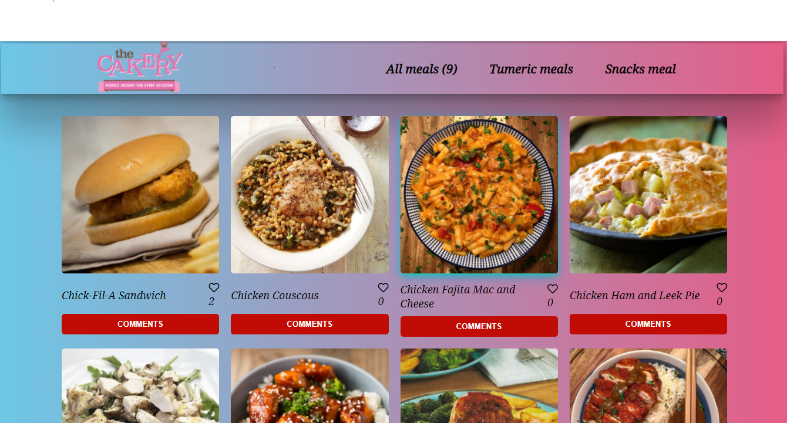

## Javascript Capstone

In this project, we have made use of 2 different APIs to display a list of meals on the homepage.

## Screenshot

## Built With

- HTML5
- CSS3
- Webpack
- Javascript

## Getting Started 

To have this project on your local machine, just follow these steps:
- Clone the repository by using `https://github.com/emmanuellekamwa/Kanban-board.git`
- Browse into the project's directory by using `cd Kanban-board`
- Run `npm install` to install all the dependencies
- Run `npm run start`

## Authors

👤 **Emmanuelle Kamwa**

-   Github: [@emmanuellekamwa](https://github.com/emmanuellekamwa)
-   Twitter: [@AlixKamwa](https://twitter.com/AlixKamwa)
-   Linkedin: [emmanuelle-kamwa-86145a1a4](https://www.linkedin.com/in/emmanuelle-kamwa-86145a1a4/)

👤 **Akintoye Damilare**

- GitHub: [@dami1080](https://github.com/dami1080)
- Linkedin: [damilare-akintoye-7b2248174](https://www.linkedin.com/in/damilare-akintoye-7b2248174/)

## 🤝 Contributing

Contributions, issues, and feature requests are welcome!

## Show your support

Give a ⭐️ if you like this project!

## Acknowledgments

- Hat tip to anyone whose code was used
- Inspiration

## 📝 License

This project is [Microverse](https://www.microverse.org/) licensed.
